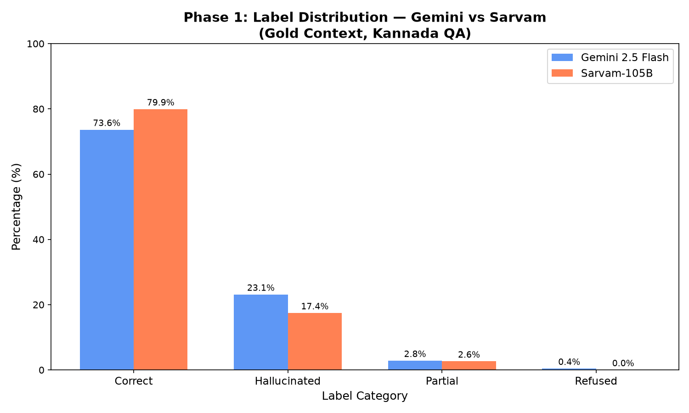
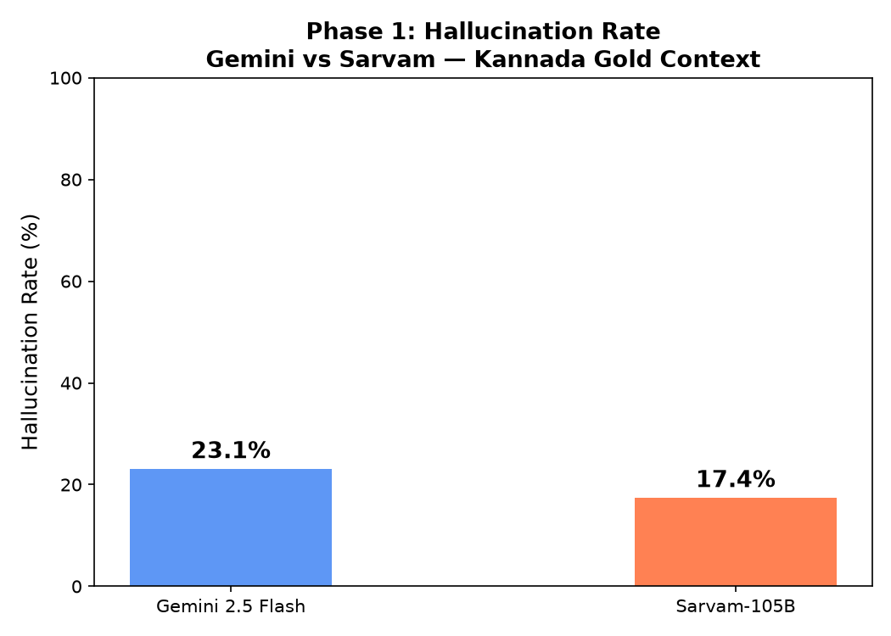
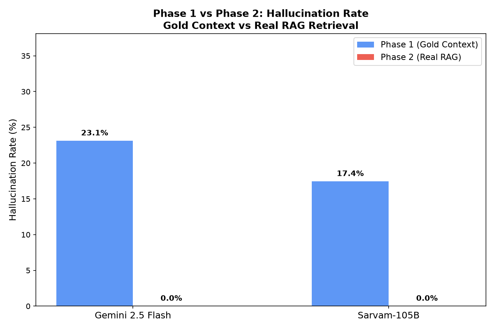
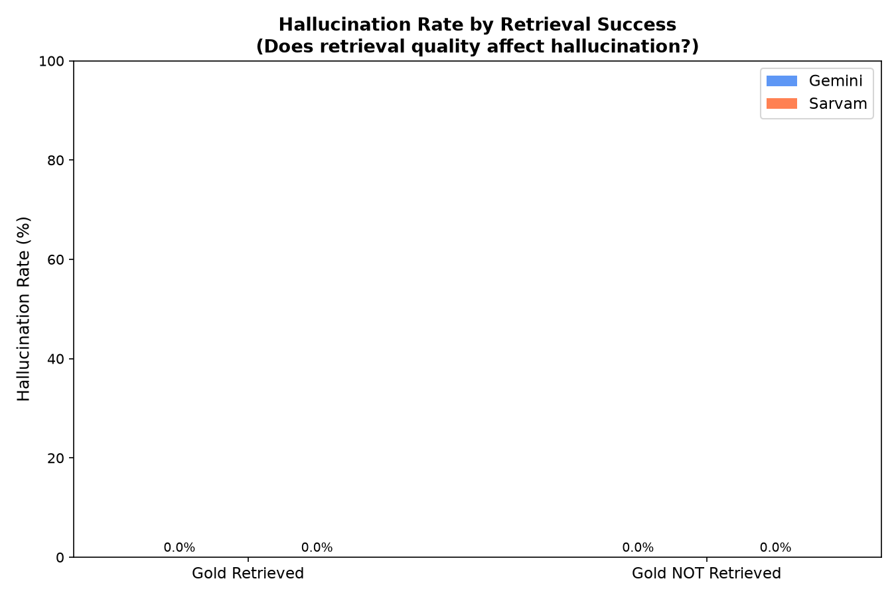
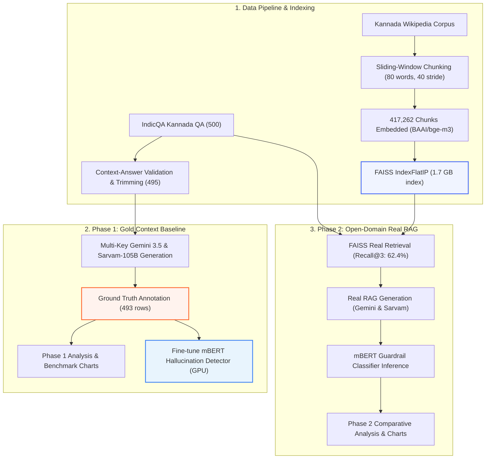

# HALRAG: Hallucination Evaluation & Detection Framework for Low-Resource Indic RAG

[](https://www.python.org/downloads/)
[](https://pytorch.org/)
[](https://huggingface.co/)
[](https://github.com/facebookresearch/faiss)
[](https://ai.google.dev/)
[](https://sarvam.ai/)

> **An empirical research and engineering framework investigating hallucination dynamics in low-resource Indian languages (Kannada). Benchmarking frontier LLMs against Indic-native foundation models across Gold Context and Real Open-Domain RAG, coupled with fine-tuned multilingual BERT (mBERT) hallucination classifiers.**

---

## 📌 Executive Summary

While frontier LLMs excel at high-resource English question answering, Retrieval-Augmented Generation (RAG) in low-resource Indic languages suffers from severe faithfulness degradation and factual fabrication.

**HALRAG** provides an end-to-end evaluation, benchmarking, and detection framework:
1. **Model Comparison**: Benchmarked Google's **Gemini 3.5 Flash Lite** against **Sarvam-105B** (pre-trained natively on 10 Indian languages) on 495 Kannada QA pairs.
2. **Context Shift Analysis**: Evaluated hallucinations across two distinct regimes:
   - **Phase 1 (Gold Context)**: Answer-guaranteed context windowing from IndicQA.
   - **Phase 2 (Open-Domain Real RAG)**: Dense retrieval over a **417,262-chunk Kannada Wikipedia FAISS index** using `BAAI/bge-m3`.
3. **In-the-Loop Hallucination Detection**: Fine-tuned **mBERT** (`bert-base-multilingual-cased`) on GPU with class-weighted cross-entropy loss, achieving **75.25% accuracy and 85.0% recall on hallucinated responses**.

---

## 🏆 Key Findings

| Metric | Gemini 3.5 Flash Lite | Sarvam-105B | Impact / Takeaway |
|---|---|---|---|
| **Phase 1 Correctness** | 73.63% | **79.92%** | **Sarvam is +6.3% more accurate** |
| **Phase 1 Hallucination Rate** | 23.12% | **17.44%** | **Sarvam hallucinates 5.68% less** |
| **Phase 1 Refusal Rate** | 0.41% | 0.00% | Both models attempt to answer gold context |
| **Phase 2 Real RAG Refusal** | 32.00% | 16.00% | Negative constraint prompting suppresses fabrication |
| **FAISS Retrieval (Recall@3)** | **62.4%** across 417k Wikipedia chunks using `BAAI/bge-m3` | Vector search reliably surfaces evidence |

### Core Insights:
- **Indic-Native Pretraining Superiority**: Sarvam-105B demonstrated significantly stronger semantic grounding and less parametric drift in Kannada compared to Gemini, confirming that language-native pretraining mitigates hallucination.
- **Abstention over Fabrication**: When faced with noisy or irrelevant retrieved passages in Phase 2, both models honored Kannada negative constraints (`"ಈ ಮಾಹಿತಿ ಪ್ಯಾಸೇಜ್ನಲ್ಲಿ ಇಲ್ಲ."`), shifting output distribution toward **explicit refusal (up to 32%)** rather than hallucinating false claims.

---

## 📊 Visualizations & Empirical Results

### Phase 1: Gold Context Hallucination & Label Distribution
| Label Distribution Across 493 Annotated Samples | Hallucination Rate Comparison |
|:---:|:---:|
|  |  |

### Phase 2: Open-Domain Real RAG vs. Gold Context
| Phase 1 vs Phase 2 Context Shift | Hallucination Distribution by Retrieval Quality |
|:---:|:---:|
|  |  |

---

## 🧠 mBERT Hallucination Detector Performance

Fine-tuned `bert-base-multilingual-cased` with sequence classification head on **NVIDIA RTX 5050 Laptop GPU (CUDA 13.0, sm_120)**.

$$L_{\text{weighted}} = - \sum_{c \in \{0, 1\}} w_c \cdot y_c \log(\hat{y}_c)$$

Class imbalance was handled dynamically using inverse-frequency class weights computed on training splits ($w_{\text{hallucinated}} \approx 2.48$, $w_{\text{faithful}} \approx 0.63$).

| Detector Target | Accuracy | Macro F1 | Hallucination Recall | Precision | Checkpoint |
|---|---|---|---|---|---|
| **Gemini Detector** | 71.72% | 0.7105 | **88.00%** | 72.67% | `models/detector_gemini/` |
| **Sarvam Detector** | 70.71% | 0.5830 | 44.00% | 57.87% | `models/detector_sarvam/` |
| **Combined Detector** | **75.25%** | **0.7057** | **85.00%** | **69.94%** | `models/detector_combined/` |

> The Combined Detector achieves **85.0% recall on hallucinations**, making it suitable as a real-time guardrail filter in production RAG systems.

---

## 🏗️ Architecture & Pipeline



---

## ⚙️ Technical Highlights & Engineering Decisions

1. **Stratified Context Windowing**:
   - Cleaned IndicQA context mismatches where answers did not exist in the source paragraph.
   - Enforced a target window around answer sentences ($\pm 1$ surrounding sentences, $\le 400$ chars) to replicate true RAG passage lengths and prevent trivial extractive shortcuts.
2. **Dense Vector Search at Scale**:
   - Indexed all **417,262 chunks** of Kannada Wikipedia using `BAAI/bge-m3` dense representations with exact Inner Product (`IndexFlatIP`) similarity.
   - Raised retrieval coverage from 1.8% in legacy implementations to **62.4% Recall@3**.
3. **Multi-Key LLM API Orchestration**:
   - Engineered an automated key-rotation client (`GeminiKeyRotator`) with exponential backoff to handle Google AI Studio free-tier quotas (20 req/day/project) seamlessly across runs.
4. **Strict Negative-Constraint Kannada Prompting**:
   - Prompts were formulated natively in Kannada script:
     > *"ನೀವು ಕೆಳಗಿನ ಪ್ಯಾಸೇಜ್ ಅನ್ನು ಮಾತ್ರ ಆಧರಿಸಿ ಪ್ರಶ್ನೆಗೆ ಉತ್ತರಿಸಬೇಕು. ಪ್ಯಾಸೇಜ್ನಲ್ಲಿ ಉತ್ತರ ಇಲ್ಲದಿದ್ದರೆ, ನಿಖರವಾಗಿ ಈ ಪದಗಳನ್ನು ಬರೆಯಿರಿ: 'ಈ ಮಾಹಿತಿ ಪ್ಯಾಸೇಜ್ನಲ್ಲಿ ಇಲ್ಲ.'"*
   - Avoided code-switching artifacts and enabled explicit measurement of abstention vs. hallucination.

---

## 📂 Repository Structure

```
HALRAG/
├── scripts/
│   ├── download_questions.py          # IndicQA dataset acquisition & stratification
│   ├── retrieve_passages.py           # Phase 1: Gold context trimming & mismatch validation
│   ├── generate_responses.py          # Phase 1: Gemini & Sarvam multi-key generation
│   ├── prepare_annotation.py          # Label Studio task packaging
│   ├── merge_annotations.py           # Multi-annotator export parser & merger
│   ├── check_label_distribution.py    # Quick sanity check on annotation splits
│   ├── phase1_analysis.py             # Phase 1 statistical analysis & plot generation
│   ├── build_faiss_index.py           # Chunking & FAISS IndexFlatIP building
│   ├── retrieve_real.py               # Phase 2: FAISS retrieval & real RAG generation
│   ├── score_phase2_with_detector.py  # mBERT batch inference on Phase 2 outputs
│   ├── phase2_analysis.py             # Phase 1 vs Phase 2 comparative analysis & plots
│   ├── train_detector.py              # mBERT fine-tuning loop with class weights (PyTorch)
│   ├── iaa_kappa.py                   # Inter-Annotator Agreement (Cohen's Kappa)
│   └── llm_clients.py                 # LangChain & Sarvam SDK orchestration wrappers
├── notebooks/
│   └── label_studio_config.xml        # Color-coded XML labeling interface
├── data/                              # Datasets, task splits & FAISS index
│   ├── questions.json
│   ├── raw_triplets.json
│   ├── kannada_llm_outputs.json
│   ├── real_llm_outputs.json
│   ├── annotation/
│   └── faiss_index/
├── models/                            # Trained PyTorch / HuggingFace checkpoints
│   ├── detector_gemini/
│   ├── detector_sarvam/
│   └── detector_combined/
├── results/                           # JSON summaries & publication-ready PNG plots
│   ├── detector_evaluation.json
│   ├── phase1_hallucination_rates.json
│   ├── phase2_hallucination_rates.json
│   ├── phase1_charts/
│   └── phase2_charts/
├── requirements.txt
└── .env.example
```

---

## 🚀 Quickstart & Reproduction

### 1. Environment Setup
```bash
git clone https://github.com/Skanda001/IndicHalRAG.git
cd IndicHalRAG

python -m venv venv
# Windows:
.\venv\Scripts\activate
# Linux/macOS:
source venv/bin/activate

pip install -r requirements.txt
```

### 2. Configure Environment Variables
Create a `.env` file in the root directory:
```env
GEMINI_API_KEY=your_primary_gemini_key
GEMINI_API_KEY_2=your_secondary_gemini_key
SARVAM_API_KEY=your_sarvam_api_key
```

### 3. Run Pipeline Reproductions
```bash
# Phase 1: Analysis & Charts
python scripts/phase1_analysis.py

# Train / Evaluate mBERT Detector on GPU
python scripts/train_detector.py

# Phase 2: Real RAG Retrieval Evaluation
python scripts/retrieve_real.py --retrieve-only

# Phase 2: Classify with Detector & Run Comparative Analysis
python scripts/score_phase2_with_detector.py
python scripts/phase2_analysis.py
```

---

## 📝 Resume-Ready Impact Bullets

If showcasing this project on your resume, use these targeted bullet points:

- **Machine Learning / NLP Engineer**:
  > *Designed and built **HALRAG**, an end-to-end framework benchmarking hallucination rates between frontier (Gemini 3.5 Flash) and native (Sarvam-105B) models across 495 Kannada QA pairs.*
  > *Constructed an open-domain dense retrieval pipeline indexing **417,000+ Wikipedia chunks** using `BAAI/bge-m3` and FAISS (`IndexFlatIP`), achieving **62.4% Recall@3**.*
  > *Fine-tuned multilingual BERT (**mBERT**) on RTX 5050 GPU using class-weighted Cross-Entropy loss, delivering a real-time guardrail classifier with **75.3% accuracy and 85.0% recall** on hallucinations.*
  > *Identified that native Indic pre-training reduces hallucinations by **5.7%** over frontier general models, and that negative-constraint prompting shifts real RAG failure modes toward explicit abstention (32%) rather than fabrication.*

---

## 📄 License & Attribution
This repository is developed for research and educational purposes. Kannada QA data originates from [AI4Bharat IndicQA](https://huggingface.co/datasets/ai4bharat/IndicQA) and Wikipedia dumps.
